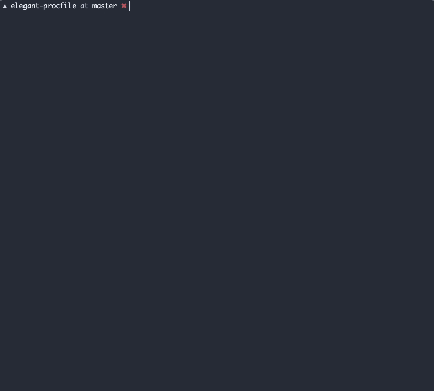

# Elegant Procfile

> A Procfile runner that provides a better developer experience

## Usage
To install elegant-procfile run:
```
npm install -g elegant-procfile
```

To use elegant-procfile run the following in a dir that contains a `Procfile`:
```
epr
```

There are extra flags that allow you to pass a different Procfile or an Env file:
```
Usage
    $ epr

Options
    --procfile, -f Specify an alternate Procfile to load
    --env, -e Specify one or more .env files to load
    --help, this output
```

## Example


To run the example yourself, run the following command from the root directory for the repository:
```
./index.js --procfile ./example/Procfile --env ./example/.env
```

## Todo
- [ ] Output folding doesn't always work
- [ ] Provide a way to stop and restart individual processes
- [ ] Provide a way to send input to a give process
